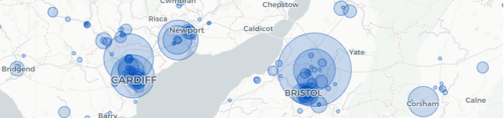

---
  output:
    govdown::govdown_document:
      page_title: "UK civil servants by postcode (2019)"
---

# Mapping the UK Civil Service

:::{.govuk-grid-row}

:::{.govuk-grid-column-one-third}
This microsite provides maps of the UK Civil Service, based on data published through the [Civil Service Statistics](https://www.gov.uk/government/collections/civil-service-statistics). Below you will find an index of the maps produced, arranged by year.
:::

:::{.govuk-grid-column-two-thirds}

:::

:::

Please note that while the data these maps are based on are Official Statistics, these maps and the analysis they contain are not an official publication of the Cabinet Office and do not represent government policy. They are for illustrative use only.

:::{.accordion}
## 2019 maps
The following map(s) are available from the 2019 Civil Service Statistics. These are based on the staff in post and their main working location as at 31 March 2019.

* [Civil Servants by local area and the core cities](cs_lad_2019.html)
* [Civil Servants by postcode and and organisation](cs_pc_2019.html) (experimental - still in development)

## 2018 maps
The following map is available from the 2018 Civil Service Statistics (accessed via the [NOMIS API](https://www.nomisweb.co.uk/)). These are based on the staff in post and their main working location as at 31 March 2018.

* [Civil Servants by local authority](cs_lad_2018.html)

:::

### About
* The data used here comes from the [Civil Service Statistics](https://www.gov.uk/government/collections/civil-service-statistics) published by the [Cabinet Office](https://www.gov.uk/cabinet-office) (from 2019 onwards, previously ONS)
* The geographic information used here is from the ONS's [OpenGeography Portal](http://geoportal.statistics.gov.uk).
* This document is produced in [RMarkdown](http://rmarkdown.rstudio.com) using [`leaflet`](https://rstudio.github.io/leaflet/) and [`DT`](https://rstudio.github.io/DT/); it has been rendered into HTML using [`govdown`](https://ukgovdatascience.github.io/govdown/).
